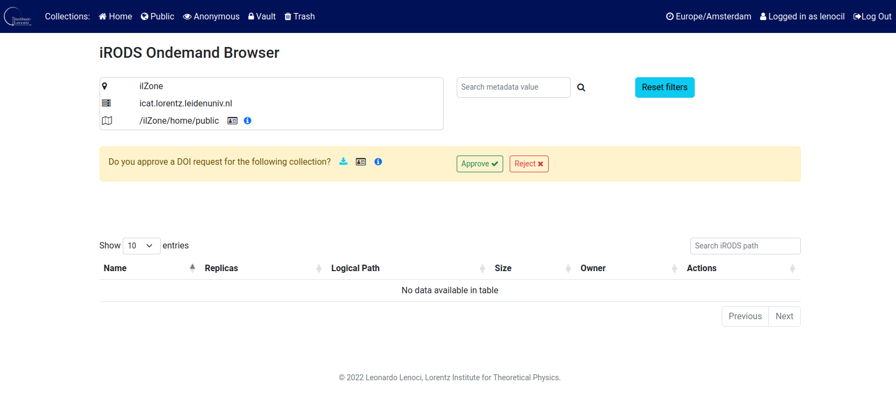
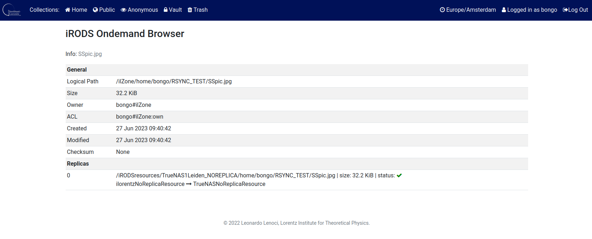

# irods_ondemand

An iRODS browser as an  OpenOnDemand Passenger App.

- [x] Direct iRODS Access within OpenOnDemand
- [x] HPC and Data Management all in one place
- [x] Easy Installation
- [x] iRODS Site Configuration
- [x] Easily Hackable with Python iRODS Client (PRC)
- [x] Python v3.6+
- [x] iRODS v4.3.0
- [x] No Custom iRODS PEPs needed
- [x] Data Archive with DOI

### Screenshots

